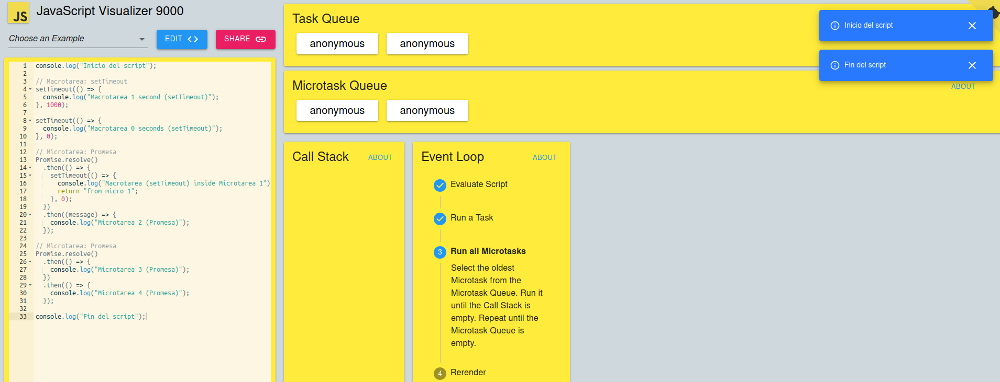
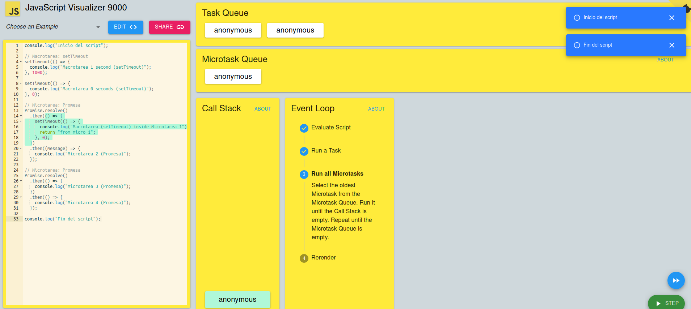
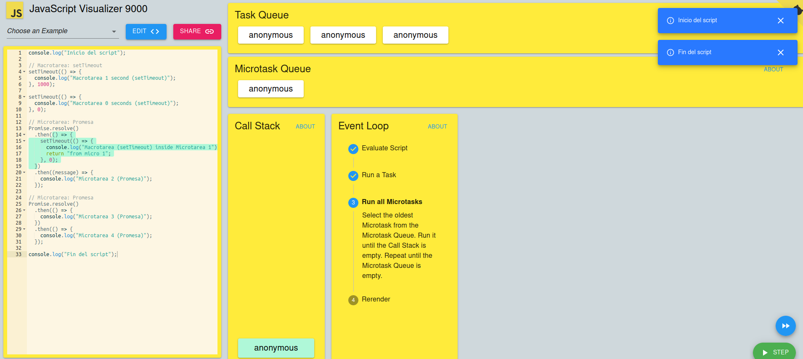
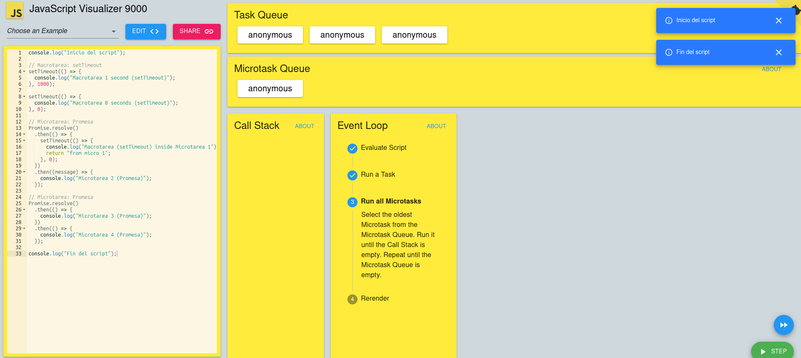

console.log("Inicio del script");

// Macrotarea: setTimeout
setTimeout(() => {
  console.log("Macrotarea 1 second (setTimeout)");
}, 1000);

setTimeout(() => {
  console.log("Macrotarea 0 seconds (setTimeout)");
}, 0);

// Microtarea: Promesa
Promise.resolve()
  .then(() => {
    setTimeout(() => {
      console.log("Macrotarea (setTimeout) inside Microtarea 1");
      return "from micro 1";
    }, 0);
  })
  .then((message) => {
    console.log("Microtarea 2 (Promesa)");
  });

// Microtarea: Promesa
Promise.resolve()
  .then(() => {
    console.log("Microtarea 3 (Promesa)");
  })
  .then(() => {
    console.log("Microtarea 4 (Promesa)");
  });

console.log("Fin del script");

    ¿Qué tareas se consideran macrotareas y cuáles son microtareas?
    Las macrotareas son los setTimeout y las microtareas son las promesas, estas dependiendo de donde vienen, si del callstack, de las macro o de las micro van a tener un orden, pero siempre van a estar en estos aspectos.
    
    ¿Cómo se relacionan las macrotareas y microtareas con el event loop?
    Se relacionan gracias a que el event loop es el encargado de mostras las microtareas y las macrotareas en ese orden.
    
    
    ¿Qué sucede cuando una microtarea genera una nueva macrotarea dentro de ella?
    cuando el event loop la llama, este ejecuta la microtarea y al tener esta una macro tarea la acomoda en la macrotareas.
    
    ¿Cómo se manejan las promesas y los setTimeout en relación con el event loop?
    El event loop lo que hace es dar un orden a las cosas, primero realiza lo que tienen en el callstack, despues se va a las microtares las cuales son las promesas, despues de esto a las macrotareas los secTimeout, si alguna de estas dos ultimas tiene otra orden se llevara a la macro o micro.